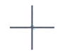
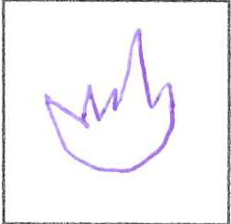
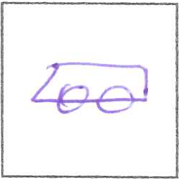

# Traitement d'images et de vidéos : extraction de pictogrammes dessinés à la main

Chaîne de traitement d'images en **C++ / OpenCV** qui transforme des scans de formulaires manuscrits en une base de données d'imagettes annotées.




## Contexte

La base **NicIcon** (anciennement disponible sur `unipen.nici.ru.nl`, désormais inaccessible) est composée de scans de formulaires numérotés. Chaque formulaire contient, à gauche, une colonne de pictogrammes avec une taille associée (*small*, *medium*, *large*) et, à droite, une ligne d'imagettes carrées où chaque participant a redessiné le pictogramme à la taille demandée.

**Objectif :** construire automatiquement une base de données à partir de ces scans. Pour chaque imagette, on récupère :

- l'image au format PNG ;
- le pictogramme qui lui correspond ;
- sa taille (small / medium / large) ;
- son numéro de formulaire, décomposé en numéro de scripteur et numéro de page ;
- sa position (ligne et colonne) sur le formulaire.

## Chaîne de traitement

| Étape | Technique OpenCV |
|-------|------------------|
| 1. Remise des scans dans un format commun | `matchTemplate` + `minMaxLoc`, `estimateRigidTransform`, `warpAffine` |
| 2. Détection et extraction des imagettes | `findContours` + parcours de la hiérarchie des contours |
| 3. Indices de ligne et de colonne | Calcul à partir de l'indice de parcours (division entière et modulo) |
| 4. Numéro de formulaire (scripteur + page) | Lecture du code binaire de la bande noire, seuillage de la moyenne des sous-images |
| 5. Label de taille | `matchTemplate` (`TM_CCOEFF_NORMED`) sur 3 templates |
| 6. Identification des pictogrammes | `matchTemplate` contre 14 pictogrammes de référence |
| 7. Mise en forme des résultats | Export d'un PNG et d'un fichier texte par imagette |

### 1. Transformation des images en un format commun

Cette étape corrige la rotation et l'échelle du scan pour que tous les éléments se superposent à une image de référence théorique (l'image 1400, choisie par le groupe parmi les scans).

1. Recherche des deux croix de repérage situées dans des coins opposés par *template matching*. Comme `matchTemplate` ne renvoie qu'une seule correspondance, plusieurs candidats sont extraits successivement pour retenir les meilleurs.
2. Tri vertical des deux croix détectées, puis association aux coordonnées de référence (`Croix1_ref`, `Croix2_ref`).
3. Calcul de la transformation affine (rotation + échelle) avec `estimateRigidTransform`.
4. Application à l'image entière avec `warpAffine`.

On obtient une image « droite » où chaque zone d'intérêt se trouve à une position fixe et prévisible, ce qui permet d'utiliser des coordonnées codées en dur pour les étapes suivantes.

### 2. Détection et extraction des imagettes

1. Détection d'un carré de base et de ses caractéristiques avec `findContours`, en parcourant la hiérarchie des contours.
2. Détection, avec `findContours` à nouveau, de toutes les formes carrées de la page qui respectent ces caractéristiques : ce sont les cases contenant une imagette.
3. Extraction des imagettes dans les carrés repérés.

### 3. Indices de ligne et de colonne

Les indices sont déduits directement de l'ordre de parcours des imagettes : un modulo donne la colonne, une division entière donne la ligne.

### 4. Numéro de formulaire (scripteur et page)

Le numéro de formulaire apparaît en haut à gauche et en bas à droite de chaque image, et aussi **en notation binaire** sous forme de carrés sur la bande noire en haut à droite. La détection utilise cette bande noire.

- `carrepresent` calcule la moyenne d'une sous-image et décide, avec un seuil de 150, si un carré blanc est présent (moyenne supérieure à 150).
- `numeropage` parcourt les carrés de la bande, additionne les valeurs binaires pondérées par la puissance de 2 correspondante et renvoie le numéro sous forme d'une chaîne de 5 caractères.

Ce numéro est ensuite coupé en deux : les 3 premiers chiffres forment le **numéro de scripteur**, les 2 derniers le **numéro de page**. Les emplacements des carrés ont été relevés une fois avec `selectROI` sur l'image de référence, puis stockés dans le tableau `tailles`.

### 5. Label de taille

Sous chaque pictogramme figure un label (*small*, *medium* ou *large*).

- Les zones des labels ont été relevées avec `selectROI` et stockées dans `emplacementstailles`. Un template par label a été extrait de la même manière.
- `rendretailleaux` convertit la zone en niveaux de gris. Si la moyenne dépasse 252, la zone est considérée comme vide (`empty`). Sinon, `matchTemplate` est lancé avec les 3 templates et le label au meilleur score est retenu.
- `rendretaille` applique ce traitement aux zones, du haut vers le bas, et renvoie un vecteur de chaînes.

La méthode de comparaison `TM_CCOEFF_NORMED` a été retenue après des tests sur une sous-base représentative de 30 images.

### 6. Identification des pictogrammes

Sur l'image alignée, 7 zones d'intérêt (aux coordonnées codées en dur) sont analysées. Chacune est comparée à une banque de 14 pictogrammes de référence (« Vagues », « Voiture », « Feu », etc.) par corrélation pixel à pixel, avec `matchTemplate` (`TM_CCOEFF_NORMED`) puis `minMaxLoc` pour obtenir un score de confiance entre 0 et 1. Le pictogramme au score maximal est retenu si ce score dépasse un seuil.

### 7. Résultats produits

Une page contient 7 × 5 = 35 imagettes. Chacune produit **deux fichiers**, soit 70 fichiers par page analysée, dans `DataDirectory/` :

- `label_scripteur_page_ligne_colonne.png` : l'imagette extraite ;
- `label_scripteur_page_ligne_colonne.txt` : ses métadonnées (`label`, `form`, `scripter`, `page`, `row`, `column`, `size`).

Exemple : `Feu_000_00_5_3.png` est l'imagette « Feu » du scripteur 000, page 00, située en ligne 5, colonne 3.

| Feu | Voiture |
|:---:|:---:|
|  |  |

## Évaluation

Deux jeux d'images ont été utilisés :

- une **base personnelle de 30 images**, choisies pour représenter la diversité de la base NicIcon ;
- la **base finale de 10 images** fournie pour l'évaluation, légèrement teintée de vert et avec des croix plus fines, ce qui a rendu la détection des zones plus difficile.

| Algorithme | Base personnelle (30 images) | Base finale (10 images) |
|------------|:---:|:---:|
| Remise des images dans un format commun | 100 % | 80 % |
| Extraction des imagettes | 96 % | plus faible |
| Indices de ligne et de colonne | 100 % | 100 % |
| Numéro de formulaire | 100 % | 100 % (sur les images correctement alignées) |
| Label de taille | 100 % | 100 % (sur les images correctement alignées) |
| Reconnaissance des pictogrammes | 100 % | 100 % |

Les erreurs sur la base finale proviennent surtout de l'étape d'alignement : quand une image n'est pas correctement remise droite, les étapes suivantes, qui reposent sur des coordonnées fixes, échouent aussi.

## Utilisation

### Prérequis

- Un compilateur C++14 (g++, clang ou MSVC)
- [CMake](https://cmake.org/) ≥ 3.10
- [OpenCV](https://opencv.org/) pour C++ (avec affichage graphique, car le programme ouvre des fenêtres `imshow`)

Sous Ubuntu / Debian :

```bash
sudo apt install build-essential cmake libopencv-dev
```

### Compilation

```bash
git clone https://github.com/XaVIIIerg/traitement-images.git
cd traitement-images
mkdir build && cd build
cmake ..
make
```

### Lancement

1. Indiquer l'image à analyser dans la variable `imName` (ligne 39 de `src/main_test_opencv.cpp`), par exemple :
   ```cpp
   string imName = "../Outils/donnees_test/s06_0001.png";
   ```
2. Lancer l'exécutable **depuis le dossier `build/`**, car les chemins du code sont relatifs à ce dossier :
   ```bash
   ./Projet_OpenCV_CMake
   ```

Les résultats sont écrits dans `DataDirectory/` (70 fichiers par image analysée).

## Structure du dépôt

```
.
├── src/
│   ├── main_test_opencv.cpp      # chaîne de traitement complète
│   ├── main_test_opencv_old.cpp  # ancienne version (désactivée, en commentaire)
│   └── histogram.cpp             # calcul d'histogrammes
├── include/histogram.hpp
├── Outils/
│   ├── Base_images/              # scans de la base personnelle (30 images)
│   ├── Base_images_alignées/     # scans remis droits
│   ├── Pictogrammes/             # pictogrammes de référence
│   ├── Tailles/                  # templates small / medium / large
│   └── donnees_test/             # scans de test
├── BDTest/                       # images de test
├── DataDirectory/                # résultats : imagettes (.png) et métadonnées (.txt)
├── Template_croix.png            # template des croix de repérage
└── CMakeLists.txt
```

## Technologies

- **Langage :** C++14
- **Bibliothèque :** OpenCV (`imgproc`, `highgui`, `imgcodecs`)
- **Build :** CMake

